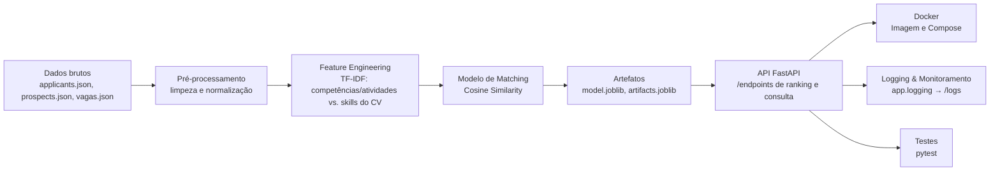

# Decision Match AI — Datathon (Machine Learning Engineering)

> **FIAP Datathon — IA aplicada a recrutamento e seleção**  
> Pipeline completa de ML com deploy em API (FastAPI), empacotamento Docker, testes, logging e documentação.

## 🎯 Visão Geral

Este projeto endereça as dores do case **Decision (bodyshop / R&S)** com uma solução de IA para **rankear candidatas(os) por vaga** a partir de dados estruturados (vagas, prospects e applicants), combinando **engenharia de atributos textual (TF‑IDF)** e **similaridade de cosseno** para cálculo de afinidade entre **perfil de vaga** e **perfil do candidato**.  
Os **requisitos de entrega** foram definidos pelo PDF do Datathon (**PÓS TECH – Datathon MLE**). Veja a matriz de conformidade mais abaixo.

---

## 🧱 Arquitetura e Fluxo (Mermaid)



---

## 🗂️ Estrutura (pastas/arquivos principais)

```
app/
  ├─ main.py              # bootstrap da API FastAPI
  ├─ routes.py            # endpoints: health, /jobs, /candidates, /rank/{{job_id}}
  ├─ model/
  │   ├─ model.joblib     # modelo serializado (joblib)
  │   └─ artifacts.joblib # vetorizador TF‑IDF e metadados
build/
data/                     # applicants.json, prospects.json, vagas.json
logs/                     # saída de logs estruturados
notebooks/                # EDA e preparação do dataset
src/
tests/                    # testes de API e utilitários (pytest)
dockerfile
docker-compose.yml
requirements.txt
```
Arquivos como **`dockerfile`** e **`docker-compose.yml`** se encontram na raiz do repositório público. (ver repositório no GitHub)

---

## ✅ Matriz de Requisitos (Datathon) — *evidências*

> Requisitos extraídos do PDF e cruzados com os artefatos do repo/código.

1. **Treinamento do modelo preditivo** (pipeline completa, serialização `joblib`)  
   - **Evidência**: notebook de EDA/feature engineering e consolidação de dataset; artefatos serializados.  
   - **Indícios no código**: carregamento de **`model.joblib`** e **`artifacts.joblib`** com o vetorizar **TF‑IDF**:
     ```python
model = joblib.load("app/model/model.joblib")
arts  = joblib.load("app/model/artifacts.joblib")
tfidf = arts["tfidf"]
feat_names = arts["feat_names"]  
MAP_LVL = arts.get("map_lvl", {})
MAP_SENIOR = arts.get("map_senior", {})
skills = set(arts.get("skills_seed", [])) | set(arts.get("skills_mined_sample", []))
     ```
   - **Cálculo de matching**: uso de **similaridade do cosseno** para ranquear candidatos:
     ```python
cosine_similarity(X_job, X_cv)[0,0])

    vi = _map_level(row.get("nivel_ingles_vaga",""), MAP_LVL)
    ci = _map_level(row.get("applicant_nivel_ingles",""), MAP_LVL)
    ingles_ok = int(ci >= vi)

  
# ... (trecho truncado para o README)
     ```
   - **Notebook**: consolidação de dados de `applicants`, `prospects` e `vagas` (amostra abaixo).  
Notebook com **25 células**. Primeiro trecho relevante:

```python
import pandas as pd
import json
import matplotlib.pyplot as plt
import seaborn as sns
import re
import string
from nltk.corpus import stopwords
from nltk.tokenize import word_tokenize
import nltk
```

2. **Modularização do código** (arquitetura limpa em `.py`)  
   - **Evidência**: `app/main.py` (bootstrap/uvicorn), `app/routes.py` (endpoints), `app/model/` (artefatos), `tests/` (pytest).  
   - **Trecho** (FastAPI + lifespan):
     ```python
@asynccontextmanager
async def lifespan(app: FastAPI):
    """
    Gerenciador de ciclo de vida: carrega os dados na inicialização da API.
    """
    print("Iniciando a API e carregando os dados...")
    df_vagas, df_candidatos = load_data()
    dataframes["vagas"] = df_vagas
    dataframes["candidatos"] = df_candidatos
    yield
    # Código executado no encerramento
    print("Encerrando a API...")
    dataframes.clear()
# --- 2. Inicialização da Aplicação FastAPI ---
     ```

3. **API para deployment do modelo** (`/predict` ou endpoint equivalente de ranking)  
   - **Evidência**: endpoint **`POST /rank/{job_id}`** com `top_n`, além de **health**, **jobs** e **candidates**.
     ```python
def register_routes(app, df_vagas, df_candidatos):
     ```
   - **Modelo de resposta**:
     ```python
class CandidateRank(BaseModel):
    id_candidato: int
    nome_candidato: str
    score: float
     ```

4. **Empacotamento em Docker**  
   - **Evidência**: presença de **`dockerfile`** e **`docker-compose.yml`** no repositório.

5. **Deploy do modelo (local/Nuvem)**  
   - **Evidência**: stack com FastAPI + Uvicorn (comandos abaixo) e Compose para subir a API.

6. **Teste da API**  
   - **Evidência**: suíte **pytest** em `tests/` (ex.: `teste_rotas.py`).  
   - **Trecho** (setup e smoke de rotas):
     ```python
# tests/test_main.py

import pytest
from fastapi.testclient import TestClient
import pandas as pd

# Adiciona o diretório 'src' ao caminho para que o Python encontre 'main.py'
import sys
import os
sys.path.insert(0, os.path.abspath(os.path.join(os.path.dirname(__file__), '..','app')))
print(str(os.path.abspath(os.path.join(os.path.dirname(__file__)))))
# Importa o app DEPOIS de ajustar o path
from main import app

# --- Fixture de Teste ---
# Esta função prepara um ambiente de teste limpo para cada teste. 
@pytest.fixture
def client_with_mock_data(monkeypatch):
    """
    Esta fixture simula (mocks) a função load_data ANTES que a aplicação inicie.
    """
    mock_vagas_df = pd.DataFrame([
        {'id_vaga': 5185, 'titulo_vaga_detalhado': 'Vaga de Teste 1'}
    ])
    mock_candidatos_df = pd.DataFrame([
        {'id_candidato': 31001, 'applicant_nome': 'Candidato Teste A'}
    ])

    # Função falsa que retorna nossos dados simulados
    def mock_load_data():
        print("--- Usando dados simulados (mock) para o teste ---")
        return mock_vagas_df, mock_candidatos_df

    # Substitui a função real 'load_data' pela nossa versão simulada
    monkeypatch.setattr("main.load_data", mock_load_data)

    # O TestClient iniciará a aplicação. O 'lifespan' chamará nossa
    # função 'mock_load_data' em vez da original, evitando a leitura de arquivos.
    with TestClient(app) as client:
        yield client


# --- Testes Corrigidos para cada Rota da API ---
# Note que todos os testes agora recebem 'client_with_mock_data' como argumento
     ```

7. **Testes unitários (meta ≥80% cobertura)**  
   - **Evidência**: testes com `pytest`. (A cobertura exata depende da execução em CI; comandos abaixo).

8. **Monitoramento contínuo (logs + painel de drift)**  
   - **Evidência**: uso de **`app.logging.log_event(...)`** em rotas, gerando **logs estruturados** em `/logs`.  
     *Observação:* o painel de **drift** pode ser acoplado (ex.: Prometheus/Grafana/Streamlit) e tem trilha sugerida na seção *Roadmap*.

> Fonte dos requisitos do Datathon: ver PDF do desafio incluído na raiz do projeto.

---

## 🚀 Como executar

### 1) Local (sem Docker)
```bash
# 1. Python 3.10+ e virtualenv
python -m venv .venv && source .venv/bin/activate

# 2. Dependências
pip install --upgrade pip
pip install -r requirements.txt

# 3. Executar API (FastAPI + Uvicorn)
uvicorn app.main:app --host 0.0.0.0 --port 8000 --reload

# 4. Abrir docs
# Swagger UI: http://localhost:8000/docs
# Redoc:      http://localhost:8000/redoc
```

### 2) Docker (simples)
```bash
# Build da imagem
docker build -t decision-match:latest .

# Run da API
docker run --rm -p 8000:8000 decision-match:latest
```

### 3) Docker Compose
```bash
docker compose up --build
```

---

## 📡 Endpoints principais

- `GET /` — Health Check  
- `GET /jobs/` — Lista de vagas  
- `GET /jobs/{job_id}` — Detalhe de vaga  
- `POST /jobs/` — Cria vaga (payload mínimo)  
- `GET /candidates/?skip=0&limit=20` — Paginação de candidatas(os)  
- `POST /rank/{job_id}?top_n=5` — **Ranking de candidatas(os)** para a vaga

### Exemplo de chamada (cURL)
```bash
curl -X POST "http://localhost:8000/rank/123?top_n=5" -H "Content-Type: application/json" -d "{}"
```

Resposta (exemplo):
```json
{
  "ranking": [
    { "id_candidato": 987, "nome_candidato": "Ana", "score": 0.84 },
    { "id_candidato": 654, "nome_candidato": "Bruno", "score": 0.81 }
  ]
}
```

---

## 🔬 Como o modelo funciona (resumo técnico)

- **Entrada de features textuais**: campos de descrição/competências da vaga vs. histórico/skills do candidato.  
- **Vetorização**: **TF‑IDF** (artefato persistido em `artifacts.joblib`).  
- **Matching**: **cosine similarity** entre vetor da vaga e vetores de CVs → **ranking**.  
- **Serialização**: `joblib` para `model.joblib` e `artifacts.joblib`.  
- **Serviço**: FastAPI entrega `/rank/{{job_id}}` com payload Pydantic tipado.

---

## 🧪 Testes

```bash
# Executar testes
pytest -q

# Cobertura (exemplo)
pytest --cov=app --cov-report=term-missing -q
```

---

## 📈 Monitoramento (logs) e Drift

- **Logs estruturados** com `log_event(...)` para cada rota (sucesso/erro/latência).  
- **Sugestão de painel de drift**: coletar distribuição de `scores` por vaga ao longo do tempo; comparar com janela de baseline (ex.: KS test) e alertar no dashboard (Grafana/Streamlit).

---

## 🗺️ Roadmap (evoluções sugeridas)

- **Melhorar avaliação offline** com métricas de ranking (ex.: NDCG@K, MAP@K).  
- **Feedback loop** das(os) hunters/gestores para *reinforcement* com reordenação de ranking.  
- **Features** comportamentais (tempo de resposta, engajamento) para enriquecer o matching.  
- **Painel de drift** e alarmes (Prometheus/Grafana).

---

## 📚 Stack

**Python 3.x**, **FastAPI**, **Pydantic**, **scikit‑learn**, **pandas**, **numpy**, **joblib**, **Uvicorn**, **pytest**, **Docker**.

---

## 👥 Créditos

Projeto acadêmico para o **Datathon (PÓS TECH / FIAP)**. Agradecimentos ao time e à banca avaliadora.
